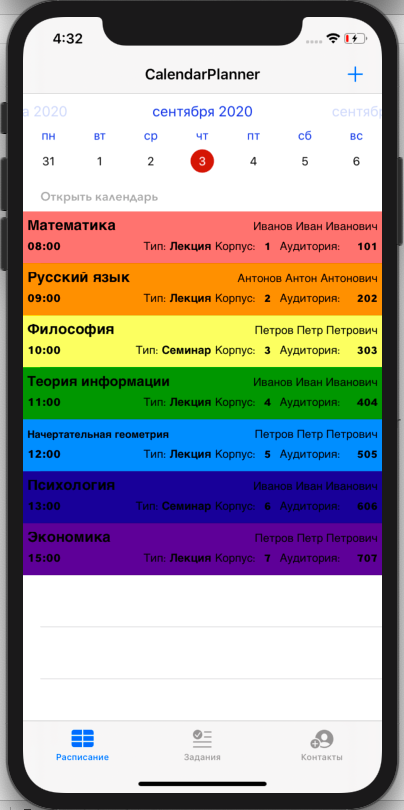
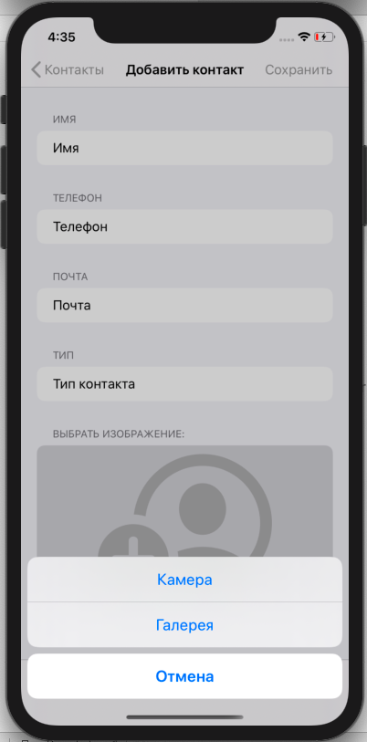

# CalendarPlanner

Приложение-расписание для преподавателей и учащихся:

- Realm;
- MVC;
- TableView: Static Cells;
- FSCalendar;
- DatePicker
- UIImagePickerController
- UISearchController

1. Добавление предмета с параметрами: Дата, время, название, тип, корпус, аудитория, преподаватель(выбор из существующего списка), цвет(выбор из списка), возможность автоматического повтора предмета каждую неделю. Возможность редактирования записи. (рис 1, рис 2)

 

2. Добавление задания с параметрами: Дата, название, задание, цвет(выбор из списка), возможность отметить выполненное задание (рис 3, рис 4)

 

3. Добавление преподавателя или друга с параметрами: Имя, телефон, почта, изображение(возможность выбрать фото из галереи или сделать фото на камеру)(рис 5, рис 6)

 
